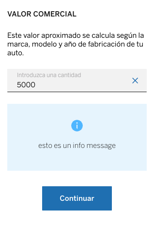

# &lt;cells-step-input-message&gt;

## With amount


## With number



Example:

### Usage with an amount
```html
<cells-step-input-message
  id="demo" class="cells-step-container"
  title="cells-step-input-message-title"
  description="cells-step-input-message-description"
  is-amount
  max="25"
  min="10"
  hide-decimals-message
  language="es-pe"
  active
>
</cells-step-input-message>
```


### Usage with a number
```html
<cells-step-input-message
  id="demo" class="cells-step-container"
  title="cells-step-input-message-title"
  description="cells-step-input-message-description"
  input="5000"
  info-message-description="cells-info-message-description"
  active
></cells-step-input-message>
```

## Properties

| Name | Description | Default | Binding |
|:---------------|:------------|:--------------|:------|
| title | Step title | cells-step-input-message-title | IN |
| description | Description of the step, first paragraph shown | cells-step-input-message-description | IN |
| stepChangeLabel | Step Change button label (when collapsed) | cells-step-input-message-step-change-label | IN |
| inputPlaceholder | Input placeholder | cells-step-input-message-placeholder-input | IN |
| infoMessageDescription | Text of info message shown after input | | IN |
| infoMessageType | Type of info message shown after input | info | IN |
| continueButton | Text to show in continue button | cells-step-input-message-continue-button | IN |
| input | Object to bind with input, it can be a number or an amount object | | IN |
| isAmount | User must indicate if the input is an amount or just a number | false | IN |
| language | Language needed for labels and amount | es-pe | IN |
| localCurrency | Local currency | PEN | IN |
| defaultCurrency | Default currency| USD | IN |
| inputLabel | Input label | cells-step-input-message-input-label | IN |
| max | Max value for an amount input | null | IN |
| min | Min value for an amount input | null | IN |
| hideDecimalsMessage | Hides decimals in max min message | true | IN |
| showSkeleton | Indicates if component should show a skeleton | false | IN |
| filledAmount | amount shown in filled style | undefined | IN |
| filledInputLabel | Text label shown in cells-key-values in filled style | cells-step-input-message-filled-input-label | IN |
| iconSize  | Icon size for cells-validate-amount-input | 24  | IN  |
| isFilledTextBlock | Flag for show the filled text block or inline | false | IN  |
| filledAmountSize  | Size for the amount filled  |   | IN  |
| maxChars  | Maximum number of chars  |   | IN  |
| isText  | Boolean variable to know if the input will contain text  |   | IN  |
| remainingAmountText  | Label for remaining character counter  |   | IN  |
| maxLength  | Max lenght to input  |   | IN  |
| icon  | Icon for cells-molecule-input  |   | IN  |
| iconErrorMessage  | Icon error for cells-molecule-input  |   | IN  |
| withoutReason  | Label to input without reason  |   | IN  |
| showSkeletonWithOutInputValidation  | Indicates if the validation includes the input |   | IN |
| errorMessage | Message that should be customized for the validation error message |   | IN |
| resetState | Boolean to custom reset |   | IN |
| disableDecimal | Boolean that enable/disable the insertion of decimals | false | IN |
| errorMessageMin | String show when the amount entered is less than min value |   | IN |
| errorMessageMax | String show when the amount entered is more than max value |   | IN |
| validateOnInputChange | Boolean If enabled the amount will be validate while typing | false | IN |
| filledTextValueClass | Class to apply when component is filled and it has not amount | cells-step-input-message__filled__value | IN |
| showHelpIcon | Boolean to show icon help | false | IN |
| additionalInfo | Flag to show additional info of offer | false | IN |
| listFile | Flag to show operations list | false | IN |
| listFileInfo | Operations list array | [] | IN |
| titleTextDescription | Label to title of cells-text-description | '' | IN |
| mainTextDescription | Label to main description of cells-text-description | '' | IN |
| stepClass | Main class to cells-step component | cells-step-input-message__step | IN |
| showSkeletonRemaining | Parameter to allow displaying the remaining information of the icon-message | false | IN |
| invalidInputValue | Parameter to allow text input without being an amount | false | IN |
| manualDisableButtonValue | Parameter to manually disable the continue button | false | IN |
| infoAlertKeyText | Text from label cells-key-values component | cells-step-input-message-curp-alert | IN |
| showIconMessage | Parameter to show icon message from cells-step component | false | IN |
| additionalLink | Flag to show an additional link | false | IN |
| additionalLinkLabel | Text to display in the additional link | cells-step-input-message-curp-security-message | IN |
| readOnly | Property to only read the input information | false | IN |
| regexValidationFromInputText | Regex to validate the text input depending on the case of each one | object | IN | 
| iconAlertColor | Property to change the color of the icon in the alert info | color-light-blue | IN |

## Events

| Key | Description |
|:---------|:-------|
| amount-set | When an amount is set and continue is pressed, and contains value |
| change-step-state | When change step button is pressed |
| continue-pressed | When an input number is set and continue is pressed and contains value |

## Styling

The following custom properties and mixins are available for styling:

### Custom Properties
| Custom Property           | Selector                                                                           | CSS Property               | Value                                                            |
| ------------------------- | ---------------------------------------------------------------------------------- | -------------------------- | ---------------------------------------------------------------- |
| --cells-text-size-12      | :host > --cells-enter-limited-amount__txt:                                         | font-size                  | .75rem                                                           |
| --cells-fontDefault       | :host                                                                              | font-family                | sans-serif                                                       |
| --cells-text-size-15      | :host                                                                              | font-size                  | 0.9375rem                                                        |
| --cells-text-size-15      | :host cells-st-button button                                                       | font-size                  | 0.9375rem                                                        |
| --cells-fontDefaultMedium | :host cells-st-button button                                                       | font-weight                | 500                                                              |
| --bbva-white              | :host .filled .cells-step-input-message__filled > --cells-key-values-inline-key:   | color                      |  #FFF          |
| --cells-text-size-15      | :host .filled .cells-step-input-message__filled > --cells-key-values-value-amount: | font-size                  | .9375rem                                                         |
| --bbva-white              | :host .filled .cells-step-input-message__filled > --cells-key-values-value-amount: | color                      |  #FFF          |
| --cells-text-size-15      | :host .filled .cells-step-input-message__filled                                    | font-size                  | 0.9375rem                                                        |
| --bbva-300                | :host(:not([active])) cells-icon-message-change-data                               | --cells-icon-message-color |  #D3D3D3 |
| --bbva-300                | :host(:not([active])) cells-icon-message-change-data p                             | color                      |  #D3D3D3 |
| --cells-text-size-15      | .filled .cells-step-input-message__filled                                          | font-size                  | 0.9375rem                                                        |
### @apply
| Mixins                          | Selector                                         | Value |
| ------------------------------- | ------------------------------------------------ | ----- |
| --cells-step-input-message      | :host                                            | {}    |
| --cells-fontDefaultLight        | :host .cells-step-input-message__description     | {}    |
| --cells-fontDefaultLight        | :host .filled .cells-step-input-message__filled  | {}    |
| --cells-fontDefaultMedium       | .filled .cells-step-input-message__filled__title | {}    |
| --cells-fontDefaultNormalItalic | .filled .cells-step-input-message__filled__value | {}    |
| --cells-step-input-message-skeleton | :host .skeleton | {}  |
