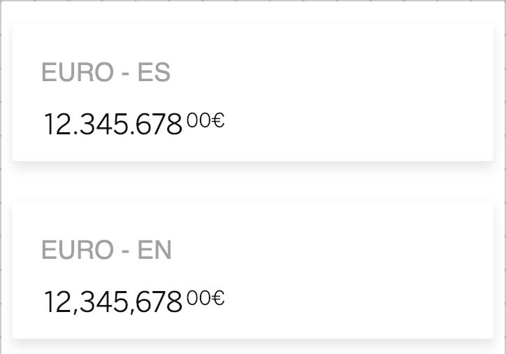

# cells-atom-amount


[Demo of component in Cells Catalog](https://catalogs.platform.bbva.com/cells)

`<cells-atom-amount>` is a component formatting an amount and its currency code into different combinations of sizes.

If amount is a negative value, .negative class is added to give a visual cue.

If the currency is in the `_screenReaderOnlyTextCurrencyMap` array (example: PEN), an `span` only visible to the screen reader will be displayed in the DOM.

Amount can be abbreviated if a scale is indicated. E.g.: 1.240.000 can be abbreviated as
1.24M if scale 6 is set and if is present (in abbreviations property).

Example:

```html
<cells-atom-amount
  amount="6423525.45"
  currency-code="EUR"
  local-currency="USD"
  language="en">
</cells-atom-amount>
```

If decimal part has more importance, `showAllDecimals` boolean property handles this. Otherwise, the decimal part will be truncated to two decimals.

Example:

```html
<cells-atom-amount
  amount="1.4394100290"
  currency-code="EUR"
  local-currency="USD"
  language="en"
  show-all-decimals="true">
</cells-atom-amount>
```

## Styling

The following custom properties and mixins are available for styling:

### Custom Properties

| Custom Property                                             | Selector                                     | CSS Property                      | Value                                                              |
| ----------------------------------------------------------- | -------------------------------------------- | --------------------------------- | ------------------------------------------------------------------ |
| --cells-atom-amount-default-color                           | :host                                        | color                             | inherit                                                            |
| --cells-fontDefault                                         | :host                                        | font-family                       | sans-serif                                                         |
| --cells-atom-amount-font-size                               | :host                                        | font-size                         | inherit                                                            |
| --cells-atom-amount-font-size__currency                     | :host .currency                              | font-size                         | inherit                                                            |
| --cells-atom-amount-margin-right__currency                  | :host .currency--left                        | margin-right                      | unset                                                              |
| --cells-atom-amount-color                                   | :host([class*=amount-])                      | --cells-atom-amount-default-color |  #121212   |
| --cells-atom-amount-margin__currency                        | :host([class*="amount-"]) .currency--right   | margin-left                       | unset                                                              |
| --cells-atom-amount-font-size__currency                     | :host([class*="amount-"]) .fractional        | font-size                         | 0.875rem                                                           |
| --cells-atom-amount-margin-left-integer                     | :host([class*="amount-"]) .integer           | margin-left                       | 0.125rem                                                           |
| --cells-atom-amount-margin-right-integer                    | :host([class*="amount-"]) .integer           | margin-right                      | 0.125rem                                                           |
| --cells-atom-amount-margin__currency                        | :host([class*=currency-]) .currency--left    | margin-right                      | unset                                                              |
| --cells-atom-amount-margin__currency                        | :host([class*=currency-]) .currency--right   | margin-left                       | unset                                                              |
| --cells-atom-amount-font-size--l                            | :host(.currency-l)                           | --cells-atom-amount-font-size     | 1.125rem                                                           |
| --cells-atom-amount-font-size__currency--l                  | :host(.currency-l)                           | currency                          | 0.75rem                                                            |
| --cells-atom-amount-large-font-size                         | :host(.amount-large)                         | --cells-atom-amount-font-size     | 1.25rem                                                            |
| --cells-atom-amount-xl-font-size                            | :host(.amount-xl)                            | --cells-atom-amount-font-size     | 1.25rem                                                            |
| --cells-atom-amount-xl-font-size                            | :host(.amount-xl) .fractional                | font-size                         | 1.25rem                                                            |
| --cells-atom-amount-font-size--xl                           | :host(.currency-xl)                          | --cells-atom-amount-font-size     | 1.25rem                                                            |
| --cells-atom-amount-font-size__currency--xl                 | :host(.currency-xl)                          | currency                          | 0.75rem                                                            |
| --cells-atom-amount-font-size--xxxl                         | :host(.currency-xxxl)                        | --cells-atom-amount-font-size     | 1.5rem                                                             |
| --cells-atom-amount-font-size__currency--xxxl               | :host(.currency-xxxl)                        | currency                          | 0.75rem                                                            |
| --cells-atom-amount-font-size--xxxxl                        | :host(.currency-xxxxl)                       | --cells-atom-amount-font-size     | 2rem                                                               |
| --cells-atom-amount-font-size__currency--xxxxl              | :host(.currency-xxxxl)                       | currency                          | 1.25rem                                                            |
| --cells-atom-amount-huge-font-size                          | :host(.amount-huge)                          | --cells-atom-amount-font-size     | 2.25rem                                                            |
| --cells-atom-amount-huge-decimals-font-size                 | :host(.amount-huge-decimals)                 | --cells-atom-amount-font-size     | --cells-atom-amount-huge-font-size                                 |
| --cells-atom-amount-huge-decimals-currency-left-padding-top | :host(.amount-huge-decimals) .currency--left | padding-top                       | 0                                                                  |
| --cells-atom-amount-huge-decimals-fractional-font-size      | :host(.amount-huge-decimals) .fractional     | font-size                         | --cells-atom-amount-huge-font-size                                 |
| --cells-atom-amount-font-size--xxxxxl                       | :host(.currency-xxxxxl)                      | --cells-atom-amount-font-size     | 3rem                                                               |
| --cells-atom-amount-font-size__currency--xxxxxl             | :host(.currency-xxxxxl)                      | currency                          | 1.75rem                                                            |
| --cells-atom-amount-font-size--l                            | :host(.currency-s)                           | --cells-atom-amount-font-size     | 1.125rem                                                           |
| --cells-atom-amount-font-size__currency--s                  | :host(.currency-s)                           | currency                          | 1rem                                                               |
| --cells-atom-amount-font-size                               | :host(.amount-big-decimals) .fractional      | font-size                         | 1.125rem                                                           |
| --cells-atom-amount-font-size__currency                     | :host(.amount-big-decimals) .currency        | font-size                         | 0.875rem                                                           |
| --cells-atom-amount-large-second-font-size                  | :host(.amount-large-second)                  | font-size                         | 1.25rem                                                            |
| --bbva-500                                                  | :host(.amount-large-second)                  | color                             |  #66666659 |
| --cells-atom-amount-span-currency-currency-left             | span.currency.currency--left                 | font-size                         | 0.813rem                                                           |

### @apply

| Mixins                                          | Selector                                           | Value |
| ----------------------------------------------- | -------------------------------------------------- | ----- |
| --cells-atom-amount                             | :host                                              | {}    |
| --cells-atom-amount-minus                       | :host .minus                                       | {}    |
| --cells-atom-amount-minus-left                  | :host .minus--left                                 | {}    |
| --cells-atom-amount-minus-right                 | :host .minus--right                                | {}    |
| --cells-atom-amount-integer                     | :host .integer                                     | {}    |
| --cells-atom-amount-fractional                  | :host .fractional                                  | {}    |
| --cells-atom-amount-separator                   | :host .separator                                   | {}    |
| --cells-atom-amount-currency                    | :host .currency                                    | {}    |
| --cells-atom-amount-currency-left               | :host .currency--left                              | {}    |
| --cells-atom-amount-currency-right              | :host .currency--right                             | {}    |
| --cells-atom-amount-abbreviation                | :host .abbreviation                                | {}    |
| --cells-atom-amount-negative                    | :host(.negative)                                   | {}    |
| --cells-atom-amount-wrapper                     | .amount-wrapper                                    | {}    |
| --cells-fontDefaultNormal                       | :host([class*=amount-])                            | {}    |
| --cells-atom-amount-class-negative              | :host([class*="amount-"]).negative                 | {}    |
| --cells-atom-amount-large                       | :host(.amount-large)                               | {}    |
| --cells-atom-amount-xl                          | :host(.amount-xl)                                  | {}    |
| --cells-atom-amount-xl-currency                 | :host(.amount-xl) .currency                        | {}    |
| --cells-atom-amount-xl-fractional               | :host(.amount-xl) .fractional                      | {}    |
| --cells-atom-amount-xl-decimals-separator       | :host(.amount-xl) .separator                       | {}    |
| --cells-atom-amount-huge                        | :host(.amount-huge)                                | {}    |
| --cells-atom-amount-huge-currency               | :host(.amount-huge) .currency                      | {}    |
| --cells-atom-amount-huge-currency-left          | :host(.amount-huge) .currency--left                | {}    |
| --cells-atom-amount-huge-fractional             | :host(.amount-huge) .fractional                    | {}    |
| --cells-atom-amount-huge-decimals               | :host(.amount-huge-decimals)                       | {}    |
| --cells-atom-amount-huge-decimals-currency      | :host(.amount-huge-decimals) .currency             | {}    |
| --cells-atom-amount-huge-decimals-currency-left | :host(.amount-huge-decimals) .currency--left       | {}    |
| --cells-atom-amount-huge-decimals-fractional    | :host(.amount-huge-decimals) .fractional           | {}    |
| --cells-atom-amount-huge-decimals-integer       | :host(.amount-huge-decimals) .integer              | {}    |
| --cells-atom-amount-huge-decimals-separator     | :host(.amount-huge-decimals) .separator            | {}    |
| --cells-atom-amount-big-decimals                | :host(.amount-big-decimals)                        | {}    |
| --cells-atom-amount-big-decimals-fractional     | :host(.amount-big-decimals) .fractional            | {}    |
| --cells-atom-amount-big-decimals-currency       | :host(.amount-big-decimals) .currency              | {}    |
| --cells-atom-amount-big-decimals-separator      | :host(.amount-big-decimals) .separator             | {}    |
| --cells-atom-amount-spaced-currency             | :host(.spaced-currency)                            | {}    |
| --cells-atom-amount-spaced-currency             | :host(.spaced-subheader-currency)                  | {}    |
| --cells-atom-amount-spaced-currency-left        | :host(.spaced-currency) .currency--left            | {}    |
| --cells-atom-amount-spaced-currency-left        | :host(.spaced-subheader-currency) .currency--left  | {}    |
| --cells-atom-amount-spaced-currency-right       | :host(.spaced-currency) .currency--right           | {}    |
| --cells-atom-amount-spaced-currency-right       | :host(.spaced-subheader-currency) .currency--right | {}    |
| --cells-atom-amount-large-second                | :host(.amount-large-second)                        | {}    |
| --cells-atom-amount-span-currency-currency-left | span.currency.currency--left                       | {}    |
