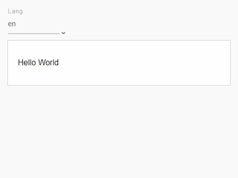

# cells-demo-lang-switcher

 

[Demo of component in Cells Catalog](https://bbva-ether-cellscatalogs.appspot.com/?view=demo#/component/cells-demo-lang-switcher)


`<cells-demo-lang-switcher>` is a dropdown menu
that changes the language of a component, which uses `CellsBehaviors.i18nBehavior`


Examples:

__With default configuration:__
```html
<cells-demo-lang-switcher></cells-demo-lang-switcher>
```

__With custom label, path to locales and langs:__
```html
<cells-demo-lang-switcher
  label="Idioma"
  locales-path="custom-path-to-locales"
  langs='["en","es","de","fr"]'>
</cells-demo-lang-switcher>
```

## Styling

The following custom properties are available for styling:

Custom property | Description | Default
:--- | :--- | :---
--cells-demo-lang-switcher-dropdown | Empty mixin applied to dropown | {}
