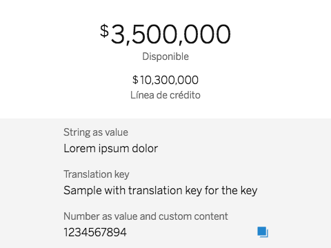

# cells-key-values

 

[Demo of component in Cells Catalog](https://catalogs.platform.bbva.com/cells)

`<cells-key-values>` displays a key (label) with one or more values. Values can
be Primitive (String or Number), an Object with a defined format or an Array of Primitive or Object values (see JS API docs).

Content inside `<cells-key-values>` is placed after the value if the property is used. To place the content before the value use
the class "before-value".

Example __with content in light DOM__:

```html
<cells-key-values
  key="Custom content"
  value="234234234">
  <p>I'll appear after the value.</p>
</cells-key-values>
```

Available __content hooks__:

```html
<cells-key-values
  key="Custom content"
  value="234234234">
  <p slot="before-value">I'll appear before the value.</p>
</cells-key-values>
```

```html
<cells-key-values
  key="Custom content"
  value="234234234">
  <span slot="before-key">I'll appear before the key.</span>
  <span slot="after-key">I'll appear after the key.</span>
</cells-key-values>
```

```html
<cells-key-values
  key="Custom content"
  value="234234234">
  <span slot="after-key">I'll appear after the key.</span>
</cells-key-values>
```

Key and values can be displayed in three different layouts:
- Key above value. __Default__ layout. No class needed.
- __Inline__: Key to the left of the value. Use the class `inline`.
- __Reversed__: Value above the key only visually. The DOM order is the opposite for accessibility reasons. Use the class `reversed`.

__Simple values__ (primitive types):

```html
<cells-key-values
  key="Account number"
  value="987979789879897">
</cells-key-values>
```

__Masked values__ (only for primitive values):

```html
<cells-key-values
  key="Account number"
  value="987979789879897"
  masked>
</cells-key-values>
```

__Monetary values__ (amounts):

```html
<cells-key-values
  key="Account number"
  local-currency="EUR"
  language="en"
  value='{
    "amount": 12323,
    "currencyCode": "EUR"
  }'>
</cells-key-values>
```

__Multiple values:__

```html
<cells-key-values
  key="Account number"
  local-currency="EUR"
  language="en"
  value='[{
    "amount": 12323,
    "class": "amount-huge",
    "currencyCode": "EUR"
  }, {
    "amount": 98797,
    "currencyCode": "CLP"
  }]'>
</cells-key-values>
```
__With full masked values:__

```html
    <cells-key-values
      key="Card pin" 
      value="12345"
      masked
      mask-chars="•"
      visible-chars="0"
      show-full-mask>
    </cells-key-values>
```

## Styling

The following custom properties and mixins are available for styling:

### Custom Properties
| Custom Property | Selector | CSS Property | Value |
| --------------- | -------- | ------------ | ----- |
### @apply
| Mixins                                                  | Selector                                               | Value |
| ------------------------------------------------------- | ------------------------------------------------------ | ----- |
| --cells-key-values-list-value                           | .cells-key-values-list > --cells-key-values-value:     | {}    |
| --cells-key-values-list                                 | .cells-key-values-list                                 | {}    |
| --cells-key-values-list-item-not-first-child            | .cells-key-values-list li:not(:first-of-type)          | {}    |
| --cells-key-values-list-inline                          | .cells-key-values-list.inline                          | {}    |
| --cells-key-values-list-inline-item-not-first-child     | .cells-key-values-list.inline li:not(:first-of-type)   | {}    |
| --cells-key-values-list-reversed                        | .cells-key-values-list.reversed                        | {}    |
| --cells-key-values-list-inline-reversed-not-first-child | .cells-key-values-list.reversed li:not(:first-of-type) | {}    |

## Classes for lists

The component includes helper classes for list elements (`<ul>` or `<ol>`) in case you'd have a list of `<cells-key-values>`.
The file needs to be imported and included in your component style.

| Class name            | Description                                      |
| :-------------------- | :----------------------------------------------- |
| cells-key-values-list | applicable to `<ul>` elements                    |
| inline                | applicable to `<ul>` elements in inline layout   |
| reversed              | applicable to `<ul>` elements in reversed layout |

Check out the demo to see examples.

Example:

```html
<link rel="import" href="../cells-key-values/cells-key-values-list-styles.html">
<style include="cells-key-values-list-styles"></style>

<ul class="cells-key-values-list">
  <li><cells-key-values></cells-key-values></li>
</ul>
```
### @apply
| Mixins                                                  | Selector                                               | Value |
| ------------------------------------------------------- | ------------------------------------------------------ | ----- |
| --cells-key-values-list-value                           | .cells-key-values-list > --cells-key-values-value:     | {}    |
| --cells-key-values-list                                 | .cells-key-values-list                                 | {}    |
| --cells-key-values-list-item-not-first-child            | .cells-key-values-list li:not(:first-of-type)          | {}    |
| --cells-key-values-list-inline                          | .cells-key-values-list.inline                          | {}    |
| --cells-key-values-list-inline-item-not-first-child     | .cells-key-values-list.inline li:not(:first-of-type)   | {}    |
| --cells-key-values-list-reversed                        | .cells-key-values-list.reversed                        | {}    |
| --cells-key-values-list-inline-reversed-not-first-child | .cells-key-values-list.reversed li:not(:first-of-type) | {}    |
