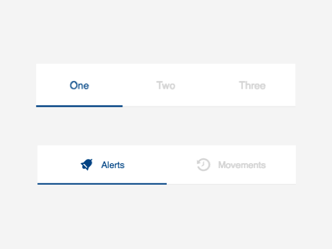

# cells-radio-tabs


[Demo of component in Cells Catalog](https://catalogs.platform.bbva.com/cells)

`<cells-radio-tabs>` displays a list of tabs from its `options` property.
The `options` property can be an array of strings or an array of objects with an optional `icon` property and a `label` property that will be used as the tab text.

Example with simple options:

```html
<cells-radio-tabs options='["Home", "Accounts"]'></cells-radio-tabs>
```

Example with text and icons:

```html
<cells-radio-tabs options='[{
  "icon": "coronita:home",
  "label": "Home"
}, {
  "icon": "coronita:alarm",
  "label": "Alerts"
}]'></cells-radio-tabs>
```

## Icons

Since this component uses icons, it will need an [iconset](https://bbva.cellsjs.com/guides/best-practices/cells-icons.html) in your project as an [application level dependency](https://bbva.cellsjs.com/guides/advanced-guides/application-level-dependencies.html). In fact, this component uses an iconset in its demo.

## Styling

The following custom properties and mixins are available for styling:

### Custom Properties
| Custom Property                                 | Selector                          | CSS Property        | Value                   |
| ----------------------------------------------- | --------------------------------- | ------------------- | ----------------------- |
| --cells-radio-tabs-font-size                    | :host                             | font-size           | 0.8125rem               |
| --cells-radio-tabs-color                        | :host                             | color               | --bbva-300              |
| --cells-radio-tabs-item-height                  | :host                             | height              | 3.4375rem               |
| --cells-radio-tabs-bg-color                     | :host                             | background-color    | --bbva-white            |
| --cells-radio-tabs-border-radius                | :host                             | border-radius       | `No fallback value`     |
| --cells-radio-tabs-option-flex                  | :host button                      | flex                | 1                       |
| --cells-radio-tabs-border-bottom-color          | :host button                      | border-bottom       | 1px solid --bbva-200    |
| --cells-radio-tabs-color                        | :host button                      | color               | --bbva-300              |
| --cells-radio-tabs-color-selected               | :host button[active] .tab-content | color               | --bbva-core-blue        |
| --cells-radio-tabs-span-min-height              | :host span                        | min-height          | 2.75rem                 |
| --cells-radio-tabs-span-min-width               | :host span                        | min-width           | 2.75rem                 |
| --cells-radio-tabs-icon-margin                  | :host .icon                       | margin              | 0 0.625rem 0 0          |
| --radio-tabs-item-width                         | :host #indicator                  | width               | `No fallback value`     |
| --cells-radio-tabs-border-radius                | :host #indicator                  | border-radius       | `No fallback value`     |
| --cells-radio-tabs-indicator-bg-color           | :host #indicator                  | background-color    | --bbva-core-blue        |
| --cells-radio-tabs-font-size                    | :host .label                      | font-size           | 0.9375rem               |
| --cells-radio-tabs-font-wight                   | :host .label                      | font-weight         | normal                  |
| --cells-radio-tabs-total-order                  | :host .total                      | order               | 2                       |
| --cells-radio-tabs-total-padding-left           | :host .total                      | padding-left        | 0.75rem                 |
| --cells-radio-tabs-active-font-weight           | :host button[active] .label       | font-weight         | --cells-fontDefaultBold |
| --cells-radio-tabs-round-color                  | :host(.round-total)               | color               | --bbva-500              |
| --cells-radio-tabs-round-border-bottom-color    | :host(.round-total) button        | border-bottom-color | --bbva-300              |
| --cells-radio-tabs-round-label-order            | :host(.round-total) button .label | order               | 2                       |
| --cells-radio-tabs-round-label-font-size        | :host(.round-total) button .label | font-size           | 0.9375rem               |
| --cells-radio-tabs-round-total-order            | :host(.round-total) button .total | order               | 1                       |
| --cells-radio-tabs-round-total-font-size        | :host(.round-total) button .total | font-size           | 0.875rem                |
| --cells-radio-tabs-total-margin-right           | :host(.round-total) button .total | margin-right        | 1rem                    |
| --cells-radio-tabs-total-margin-left            | :host(.round-total) button .total | margin-left         | 0                       |
| --cells-radio-tabs-round-total-color            | :host(.round-total) button .total | color               | --bbva-white            |
| --cells-radio-tabs-round-total-background-color | :host(.round-total) button .total | background-color    | --bbva-500              |
### @apply
| Mixins                                | Selector                                 | Value |
| ------------------------------------- | ---------------------------------------- | ----- |
| --cells-radio-tabs                    | :host                                    | {}    |
| --cells-radio-tabs-option             | :host button                             | {}    |
| --cells-radio-tabs-selected           | :host button[active] .tab-content        | {}    |
| --cells-radio-tabs-tab-hover          | :host button:hover .tab-content          | {}    |
| --cells-radio-tabs-span               | :host span                               | {}    |
| --cells-radio-tabs-content            | :host .tab-content                       | {}    |
| --cells-radio-tabs-icon               | :host .icon                              | {}    |
| --cells-ratio-tabs-indicator          | :host #indicator                         | {}    |
| --cells-ratio-tabs-label              | :host .label                             | {}    |
| --cells-ratio-tabs-total              | :host .total                             | {}    |
| --cells-radio-tabs-option-focus-label | :host button[active] .label              | {}    |
| --cells-radio-tabs-round-label        | :host(.round-total) button               | {}    |
| --cells-radio-tabs-round-label-class  | :host(.round-total) button .label        | {}    |
| --cells-ratio-tabs-round-total        | :host(.round-total) button .total        | {}    |
| --cells-ratio-tabs-round-total-before | :host(.round-total) button .total:before | {}    |
