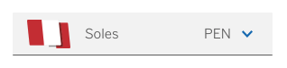

# &lt;cells-select-modal&gt;

Your component description.


Example:



```html
<cells-select-modal 
  is-input-style
  image="images/flag-usa.svg" 
  item-selected="Soles" 
  secondary-selected="PEN"
></cells-select-modal>
```

## API

**Properties**:

| Name | Type | Description | Binding |
| --- | --- | --- | --- |
| isInputStyle | Boolean | Shows component with input styles | IN |
| hideSelectorIcon | Boolean | Hides selector icon | IN |
| image | String | URL for image selector | IN |
| itemSelected | String | Item selected of the selector | IN |
| title | String | Title label of the selector | IN |
| secondarySelected | String | Secondary selected text to show before selector icon | IN |
| ellipsis | Boolean | Style for text ellipsis | IN |

**Methods**:

| Name | Description | Input | Output |
| --- | --- | --- | --- |
| _openDocumentModalSelector | Dispatches event to open modal selector only if selector icon is shown | | open-document-modal-selector |

## Icons

Since this component uses icons, it will need an [iconset](https://bbva.cellsjs.com/guides/best-practices/cells-icons.html) in your project as an [application level dependency](https://bbva.cellsjs.com/guides/advanced-guides/application-level-dependencies.html). In fact, this component uses an iconset in its demo.

## Styling

The following custom properties and mixins are available for styling:

### Available classes
  - `size-xl` --> Height of input is 60px instead of regular 48px


### Custom Properties
| Custom Property                                                        | Selector                                                   | CSS Property                                            | Value                         |
| ---------------------------------------------------------------------- | ---------------------------------------------------------- | ------------------------------------------------------- | ----------------------------- |
| --cells-select-modal-document-selector-label-color                     | :host > .document-selector > .header-texts > .header-title | color                                                   | --bbva-500                    |
| --cells-select-modal-texts-padding-themed                              | :host > .document-selector > .header-texts                 | padding                                                 | --cells-select-modal-padding) |
| --cells-fontDefault                                                    | :host > .document-selector > .modal-icon >                 | font-family                                             | sans-serif                    |
| --cells-select-modal-padding-themed                                    | :host > .document-selector > .modal-icon >                 | padding                                                 | --cells-select-modal-padding) |
| --bbva-dark-medium-blue                                                | :host > .document-selector > .modal-icon >                 | --cells-select-modal-document-selector-modal-icon-color | `No fallback value`           |
| --cells-select-modal-img-padding-themed                                | :host > .document-selector > .modal-icon >                 | padding                                                 | --cells-select-modal-padding) |
| --cells-select-modal-document-selector-label-color                     |                                                            | color                                                   | --bbva-500                    |
| --cells-select-modal-document-selector-label-color                     |                                                            | color                                                   | --bbva-500                    |
| --cells-select-modal-document-selector-placeholder-color               |                                                            | color                                                   | --bbva-500                    |
| --cells-select-modal-placeholder-padding-themed                        |                                                            | padding                                                 | --cells-select-modal-padding) |
| --cells-select-modal-selected-padding-themed                           |                                                            | padding                                                 | --cells-select-modal-padding) |
| --cells-select-modal-document-selector-placeholder-selected-icon-color |                                                            | color                                                   | --bbva-white                  |
| --cells-text-size-15                                                   |                                                            | font-size                                               | .9375rem                      |
| --cells-select-modal-document-selector-placeholder-color               |                                                            | color                                                   | --bbva-500                    |
| --cells-select-modal-secondary-padding-themed                          |                                                            | padding                                                 | --cells-select-modal-padding) |
| --cells-select-modal-document-selector-bg-color                        |                                                            | background-color                                        | --bbva-100                    |
| --cells-text-size-15                                                   |                                                            | font-size                                               | .9375rem                      |
| --cells-select-modal-img-padding-themed                                |                                                            | padding                                                 | --cells-select-modal-padding) |
### @apply
| Mixins                                                | Selector                                                   | Value |
| ----------------------------------------------------- | ---------------------------------------------------------- | ----- |
| --cells-select-modal-header-title                     | :host > .document-selector > .header-texts > .header-title | {}    |
| --cells-select-modal-header-texts                     | :host > .document-selector > .header-texts                 | {}    |
| --cells-select-modal                                  | :host > .document-selector > .modal-icon >                 | {}    |
| --cells-select-modal-label                            |                                                            | {}    |
| --cells-select-modal-placeholder                      |                                                            | {}    |
| --cells-fontDefaultLight                              |                                                            | {}    |
| --cells-select-modal-document-selector                |                                                            | {}    |
| --cells-select-modal-input-style                      | :host([is-input-style])                                    | {}    |
| --cells-select-modal-input-style-document-selector    | :host([is-input-style]) .document-selector                 | {}    |
| --cells-select-modal-input-style-xl                   | :host([is-input-style].size-xl)                            | {}    |
| --cells-select-modal-input-style-xl-document-selector | :host([is-input-style].size-xl) .document-selector         | {}    |
| --cells-select-modal-st-button                        | :host > cells-st-button                                    | {}    |
| --cells-select-modal-disabled                         | :host([disabled])                                          | {}    |
| --cells-select-modal-custom-modal                     | :host(.custom-modal)                                       | {}    |
