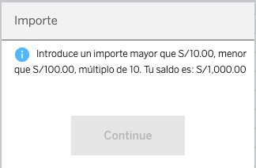
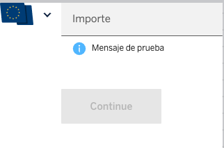

# &lt;cells-validate-amount-input&gt;

User amount input with validation and currency selector.


With all possible validations:


With currency selector: 


Example:
```html
<cells-validate-amount-input
  currency-code="PEN"
  local-currency="PEN"
  language="es"
  name="unique-name"
  icon-size="16"
></cells-validate-amount-input>
```

More examples of all different uses with different validations can be found on demo page.

## Description

This component has a numeric input with a currency so that the user can enter an amount.

A currency selector can be set by setting a *flag-image*.

This component also validates the amount the user inputs against certain parameters:
* A minimum.
* A maximum.
* Multiple of a number.
* User available balance.

When validating against minimum and maximum, both error messages can be set, in order to set the same error instead of distinguishing between an amount below minimum or above maximum. With this parameter, both errors will be the same.

There is also an *error-prefix* that can be set in order to have different error messages in different operatives.


### Behavior

The behavior of the input and the info/error messages has been validated with UX and must have the following behavior. Any modification of this behavior should be validated against all UX teams:

When input is empty:
* info message is shown (if set)
* button is disabled

Validations made on blur:
* Min, max, multiple.

Validations made on key press (when amount changes):
* User balance.

### Error messages

#### Priority
1. User balance
2. Min/max
3. Multiple

#### Error message keys
Error message keys depend on error type. This way, all possible error keys would be:
* `${errorPrefix}`-error-min
* `${errorPrefix}`-error-max
* `${errorPrefix}`-error-multiple
* `${errorPrefix}`-error-user-balance

## Styling

The following custom properties and mixins are available for styling:

### Custom Properties
| Custom Property                        | Selector                                                 | CSS Property     | Value              |
| -------------------------------------- | -------------------------------------------------------- | ---------------- | ------------------ |
| --cells-validate-amount-input-error-bg | :host > --cells-molecule-amount-input-invalid: unquote(" | background-color | --bbva-white-coral |
| --cells-fontDefault                    | :host                                                    | font-family      | sans-serif         |
### @apply
| Mixins                                             | Selector                                | Value |
| -------------------------------------------------- | --------------------------------------- | ----- |
| --cells-validate-amount-input-amount-container     | .amount-container                       | {}    |
| --cells-validate-amount-input-currency-selector    | .amount-container .currency-selector    | {}    |
| --cells-validate-amount-input-limited-amount-input | .amount-container .limited-amount-input | {}    |

## API

**Properties**:

| Name | Type | Description | Binding | DefaultValue
| --- | --- | --- | --- | --- |
| setInitialDecimals | Boolean | Flag to control if formatting of the initial amount is not necessary | IN | |
| autoFormat | Boolean | IF Enabled the value of the input will change to the output  on blur. Turning "0" into "0.00"| IN | |
| invalid | Boolean | Negated of `_valid` | | |
| disableDecimal | Boolean | If true, deny the insert of decimals | IN | false |
| spaceCurrency | Boolean | If true, currency space appears | IN | false |
| disableValidateOnFocusOut | Boolean | disable validate input on focus out | IN | false |
| disableValidateOnBlur | Boolean | disable validate input on blur | IN | false |
| type | String | Input type config | IN | |
| inputMode | String | Input mode config | IN | |