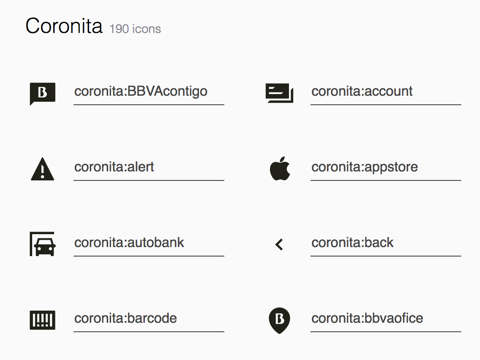

# coronita-icons


[Demo of component in Cells Catalog](https://catalogs.platform.bbva.com/cells)

## Generating iconset

Use [iconset-generator](https://globaldevtools.bbva.com/bitbucket/projects/CTOOL/repos/iconset-generator/browse) to update or build the iconset from `icons.json` file.

Install dependencies:
```bash
$ bower install
```

Generate iconset:
```bash
$ generate-iconset
```